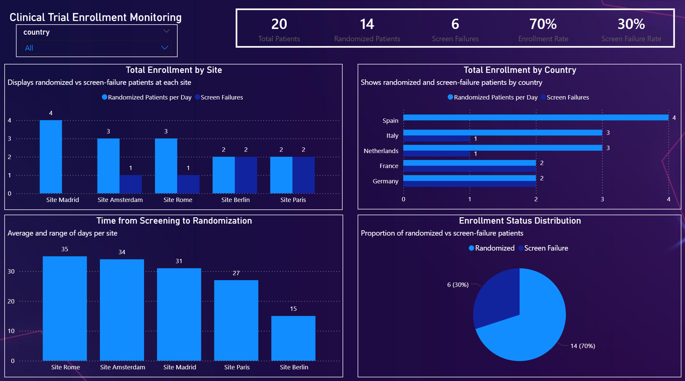
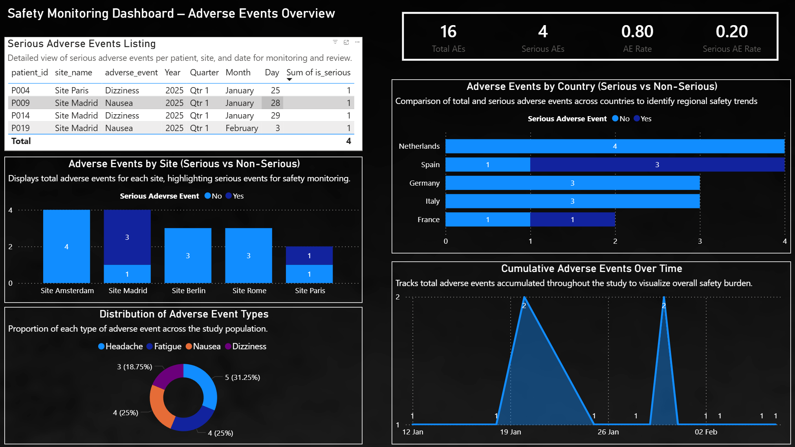
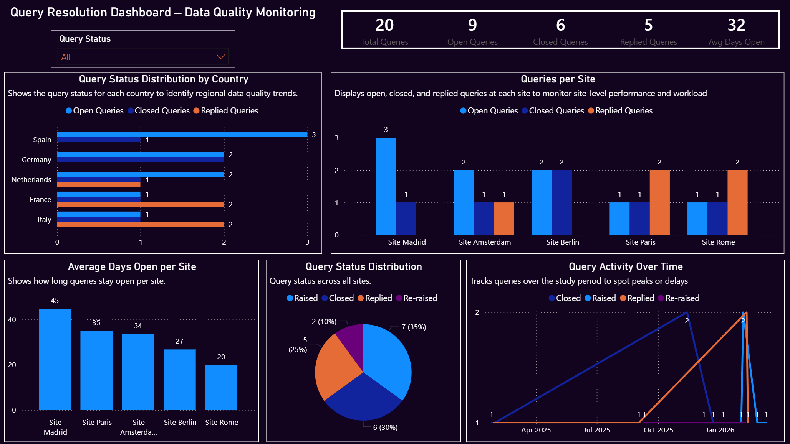

# Clinical Trial Data Analysis & Dashboard (Python + Power BI)

## Project Overview
This project presents an end-to-end data analytics solution for monitoring a Phase II clinical trial. It combines **data cleaning in Python** with **interactive dashboards in Power BI** to track study performance, safety, and data quality.

The goal was to transform raw clinical data into structured datasets and deliver actionable insights for stakeholders to support timely and informed decision-making.

---

## Business Context
Clinical trials require continuous monitoring to ensure:
- Efficient patient enrollment  
- Patient safety through adverse event tracking  
- High data quality and timely query resolution  

This project addresses these needs by providing a centralized analytics solution across multiple study dimensions.

---

## End-to-End Workflow
This project follows a complete data analytics pipeline:

1. **Data Cleaning & Preparation (Python)**
   - Data validation and transformation  
   - Handling missing and inconsistent values  
   - Feature engineering for key metrics  

2. **Data Export**
   - Clean datasets exported as CSV files  

3. **Data Visualization (Power BI)**
   - Interactive dashboards built using DAX and data modeling  

---

## Data Preparation (Python)
The raw datasets were cleaned and transformed to ensure accuracy and usability.

### Key Cleaning Steps:
- Standardized date formats across all datasets  
- Handled missing values (e.g., screen failures, unresolved queries)  
- Created calculated fields (e.g., days between events, flags for key metrics)  
- Standardized categorical values (e.g., Yes/No fields)  
- Ensured consistency across multiple data sources  

These steps ensured reliable downstream analysis and reporting :contentReference[oaicite:0]{index=0}  

---

## Dashboards (Power BI)

### 1. Enrollment Monitoring Dashboard
- Enrollment rate by site and country  
- Screen failure rate analysis  
- Time from screening to randomization  
- Identification of high- and low-performing sites  

---

### 2. Safety Monitoring Dashboard
- Adverse events by site and country  
- Serious vs non-serious events  
- Distribution of adverse event types  
- Trend of adverse events over time  

---

### 3. Query Resolution Dashboard
- Open, closed, and replied queries  
- Average query resolution time  
- Query trends over time  
- Data quality performance by site  

These dashboards provide a comprehensive view of study performance and risks :contentReference[oaicite:1]{index=1}  

---

## Key Metrics
- Enrollment Rate  
- Screen Failure Rate  
- Time to Randomization  
- Adverse Event Rate (total & serious)  
- Query Resolution Time  
- Open vs Closed Queries  

---

## Dashboard Preview

### Enrollment Dashboard

### Safety Dashboard

### Query Dashboard

---

## Tools & Technologies
- Python (Pandas, NumPy)  
- Power BI  
- Power Query  
- DAX (Data Analysis Expressions)  

---

## How to Use
1. Explore cleaned datasets in the `/data` folder  
2. Review Python scripts in the `/python` folder  
3. Open the `.pbix` file using Power BI Desktop  
4. Interact with dashboards using filters and slicers  

Tip: Use filters (site, country, date) to explore trends and drill down into performance metrics.

---

## Key Insights
- Identified variability in enrollment performance across sites  
- Highlighted trends in adverse events and potential safety signals  
- Revealed delays in query resolution impacting data quality  
- Enabled early identification of operational risks  

---

## What I Learned
- Building an end-to-end data analytics pipeline  
- Data cleaning and transformation using Python  
- Designing business-focused dashboards in Power BI  
- Translating raw data into actionable insights  

---

## Project Structure
